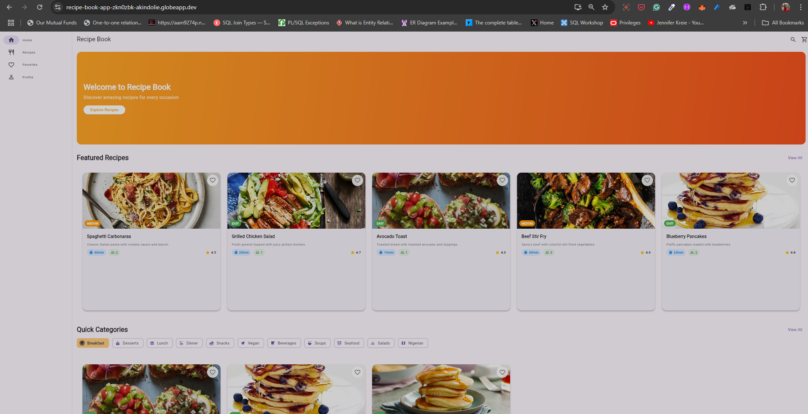
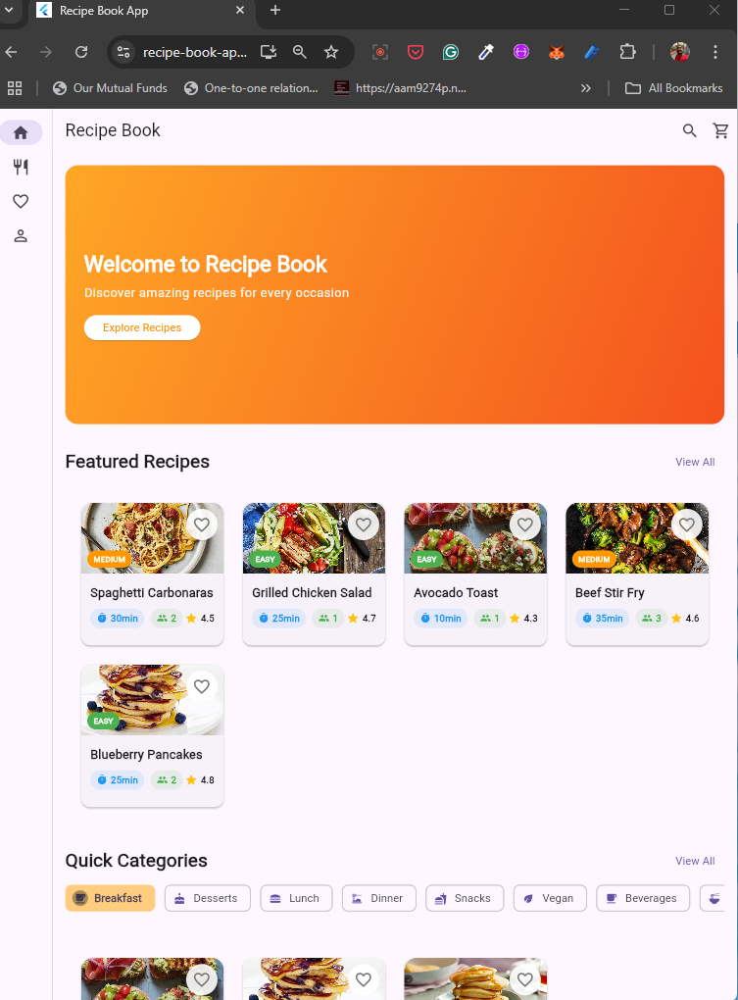
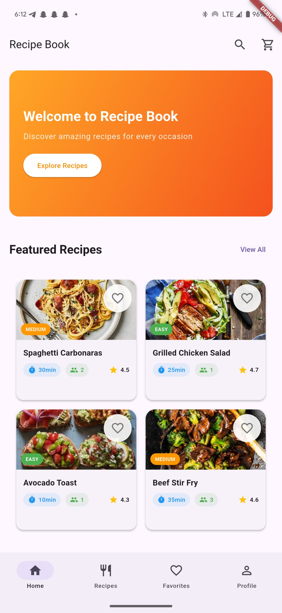

# 🍽️ Responsive Recipe Book App

Welcome to your **Capstone Project for Week 3**! This is a complete, professional-quality **Recipe App** built using **Flutter**, showcasing your ability to build responsive, interactive, and user-friendly applications across all screen sizes — mobile, tablet, and desktop.


---

## 📸 Screenshots

<table>
  <tr>
    <td></td>
    <td></td>
    <td></td>
  </tr>
  <tr>
    <td align="center">Desktop View</td>
    <td align="center">Tablet View</td>
    <td align="center">Mobile View</td>
  </tr>
</table>


---

## 🧩 App Features & Requirements

### ✅ Core Features (Must-Have)

#### 🏠 Home Screen
- 🎠 **Featured recipes carousel**
- 🚀 **Quick category navigation**
- 🔍 **Search functionality**
- 🖼️ **Responsive hero section**

#### 📋 Recipe List Screen
- 🔄 **Grid/List view toggle**
- 📂 **Category filtering**
- 🔎 **Search/filter by text**
- 💡 **Responsive layout:**
    - 📱 Mobile → 1 column
    - 📱💻 Tablet → 2–3 columns
    - 🖥️ Desktop → 4+ columns

#### 📖 Recipe Detail Screen
- 🖼️ **Image gallery**
- 🧂 **Ingredients with dynamic serving adjustments**
- 📝 **Step-by-step cooking instructions**
- 🍎 **Nutrition breakdown**
- ❤️ **Like/Favorite feature**

#### ❤️ Favorites Screen
- 📌 **Saved recipes**
- ⚡ **Quick-access management**
- 🧱 **Responsive grid layout**

#### 🧭 Navigation
- 📱 **Bottom navigation (mobile)**
- 💻 **Navigation rail (tablet)**
- 🖥️ **Extended rail + drawer (desktop)**

---

### ✨ Advanced Features (Nice-to-Have)

#### 🛒 Shopping List Generator (Coming Soon)
- 🧾 Convert ingredients into a shopping list
- ➕ Auto quantity aggregation
- ✅ Check-off items as you go

#### 🔍 Advanced Search (Planned)
- 🥦 Filter by dietary preferences (e.g., vegan, keto)
- 🎯 Advanced search logic

---

## 📦 Tech Stack

| Technology    | Usage                            |
|---------------|----------------------------------|
| Flutter       | UI toolkit                       |
| Dart          | Programming language             |
| LayoutBuilder | Responsive design implementation |
| `setState`    | Local state management           |
| Widgets       | Modular reusable components      |

---

## 📁 Folder Structure

```
lib/
├── main.dart
├── models/
│   ├── recipe.dart
│   ├── ingredient.dart
│   ├── nutrition_info.dart
│   └── user_preferences.dart
├── screens/
│   ├── home_screen.dart
│   ├── recipe_list_screen.dart
│   ├── recipe_detail_screen.dart
│   ├── favorites_screen.dart
│   ├── shopping_list_screen.dart
│   └── profile_screen.dart
├── widgets/
│   ├── common/
│   │   ├── responsive_navigation.dart
│   │   ├── custom_app_bar.dart
│   │   └── loading_indicator.dart
│   ├── recipe/
│   │   ├── recipe_card.dart
│   │   ├── recipe_grid.dart
│   │   ├── ingredient_list.dart
│   │   └── instruction_steps.dart
│   └── search/
│       ├── search_bar.dart
│       └── filter_chips.dart
├── utils/
│   ├── responsive_breakpoints.dart
│   ├── route_generator.dart
│   ├── constants.dart
│   └── helpers.dart
└── data/
    ├── sample_recipes.dart
    └── recipe_categories.dart
```

---


## 🔧 How to Run

1. Clone this repo
2. Run `flutter pub get`
3. Run on your desired device using `flutter run`

---

## 👏 Credits

Built as part of the Flutter Capstone Project - Week 3.  
Crafted with ❤️ and 🍳 by [Your Name].
